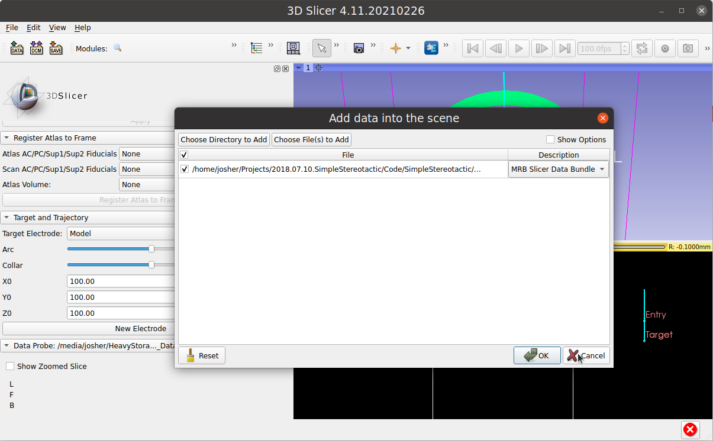
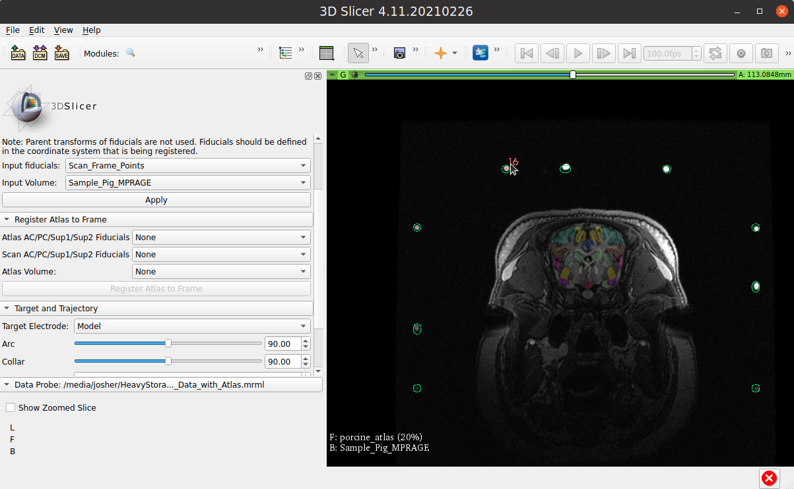

# Example Instructions
After properly [installing](INSTALLATION.md) the SimpleStereotactic Extension, the following instructions should be easy to follow.

## **Select Extension:**

This loads the blank extension that is ready to load both images and atlas.

## **Load Example File:**
The example file, **Porcine_Sample_Data_with_Atlas**, can be loaded into 3D Slicer via a simple drag-and-drop operation.

Alternatively, the file menu option, Add Data (Cntrl-O), can be used.

## **Register Image and Atlas:**

The medical record bundle, **Porcine_Sample_Data_with_Atlas**, comes complete with fiducials, *Scan_Frame_Points*, marking the centers of 22 cross sections of the fiducial z-bar. Normally, these would be manually placed by the user on several slices of the image at hand.

### **Register Image:**
1. Choose *Scan_Frame_Points* from the *Input Fiducials* drop down menu.
2. Choose *Sample_Pig_MPRAGE* from the *Input Volume* drop down menu.
3. Press the *Apply* button.

Now both the fiducial points and the image are registered to the wireframe representation of the fiducial z-bars.

### **Register Atlas:**
1. Choose *Atlas_AC_PC* from the *Atlas AC/PC/Sup1/Sup2 Fiducials* drop down menu.
2. Choose *Scan_AC_PC* from the *Scan AC/PC/Sup1/Sup2 Fiducials* drop down menu.
3. Choose *porcine_atlas* from the *Atlas Volume* drop down menu.
4. Press the *Register Atlas to Scan* button.

Now the atlas is registered to the scan using matching Anterior Commissure/Posterior Commissure points. Additional points can be added superior to the AC/PC for rotational stability. All of these points can be adjusted and the registration repeated until desired fit.

When selected as a secondary overlay, labeled atlas regions will be denoded in the *Data Probe* area of 3D Slicer.

## **Plan Target and Trajectory:** 
There are two different mechanisms to plan the target and trajectory 
1. Use the "Target and Trajectory"  Area of the SimpleStereotactic Extension 
2. Use the **Target** and **Entry** fiducials in the "Targets" Markups List. Moving these will automatically update the parameters in the "Target and Trajectory" area.  Furthermore, all views will update to the new position of the moved fiducial.
    * Note: If the **Target** is dragged out of the allowed bounding box (50-150 in all directions) it will assume the nearest boundary point on that bounding box.

The *Arc*, *Collar*, *X0*, *Y0*, and *Z0* coordinates are ready for the physical frame.

Multiple trajectories can be made and explored by using the "New Electrode" button. Each electrode will save its parameters and switch the frame back to those when selected by the *Target Electrode* drop down menu.

### **Checking the Trajectories:**
The IGT *Volume Reslice Driver* Extension can be used to examine the anatomy both perpendicular and parallel to the path of the canula. This can help ensure that critical vasculature is not damaged by a chosen trajectory.

