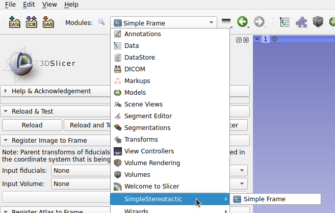

# SimpleStereotactic
This is an unregistered 3D Slicer Project to assist in stereotactic navigation with a compass frame.

The coordinates describe the parameters necessary to reproduce the targeting. Parameters are consistent with those for a [Compass Stereotactic Frame](http://www.ciimedical.com/index.php?p=compass).  This project can be modified to accomodate other coordinate systems.

## Installation: 
See the installation [file](INSTALLATION.md) for complete installation instructions

**Select Extension:**

This loads the blank extension that is ready to load both images and atlas.

**The sequence of use is as follows:**

1. Acquire image: Drag and drop image representing an MRI or CT with a localizer (z-bar, n-bar) into 3D Slicer 

2. Register Image to Frame: 
   - It is best to first transform the Image Volume to appropriate Inferior-Supperior/Left-Right/Anterior-Superior Orientation for best results 

   - Create a Fiducial set (Image_Points here) that places fiducials in the middle of the cross section of the localizer at least three different depths in the coronal section: 

   - Select Fiducials and Image in the "Register Image to Frame" Section of the Extension 

   - Press Apply
3. Register Atlas to Frame: After selecting the Anterior Commissure (AC) and Posterior Commissure(PC) on the Image ([INRA Pig Atlas](https://www6.rennes.inra.fr/adnc_eng/Home/News-Focus/Pig-brain-atlas) See Below) 

   - Select AC/PC for the Atlas 
   - Select AC/PC for the Image
   - Press "Register Atlas to Frame"
   - The Atlas will be visible after insertion and appropriate visibility adjustment 

   - Subcortical regions will be annotated in the Data Probe pane of slicer

4. Target and Trajectory: There are two different mechanisms to plan the target and trajectory 
    - Use the "Target and Trajectory"  Area of the SimpleStereotactic Extension 

    - Use the "Target" and "Entry" fiducials in the "Targets" Markups List. Moving these will automatically update the parameters in the "Target and Trajectory" area.  Furthermore, all views will update to the new position of the moved fiducial. 

**Path View:**

The IGT PathExplorer Extension can be used to examine the anatomy both perpendicular and parallel to the path of the catheter.

~~A pig atlas can be downloaded from https://www6.rennes.inra.fr/adnc_eng/Home/News-Focus/Pig-brain-atlas or more directly https://www6.rennes.inra.fr/adnc_eng/content/download/3394/36018/version/1/file/Atlas.mrb.~~  This link is no longer viable. Until the original can be appropriately sourced, it will be available at this [Dropbox Link](https://www.dropbox.com/s/2gvprhdo2ha6urf/Atlas.mrb?dl=0). Put the Atlas Model into the Atlas
