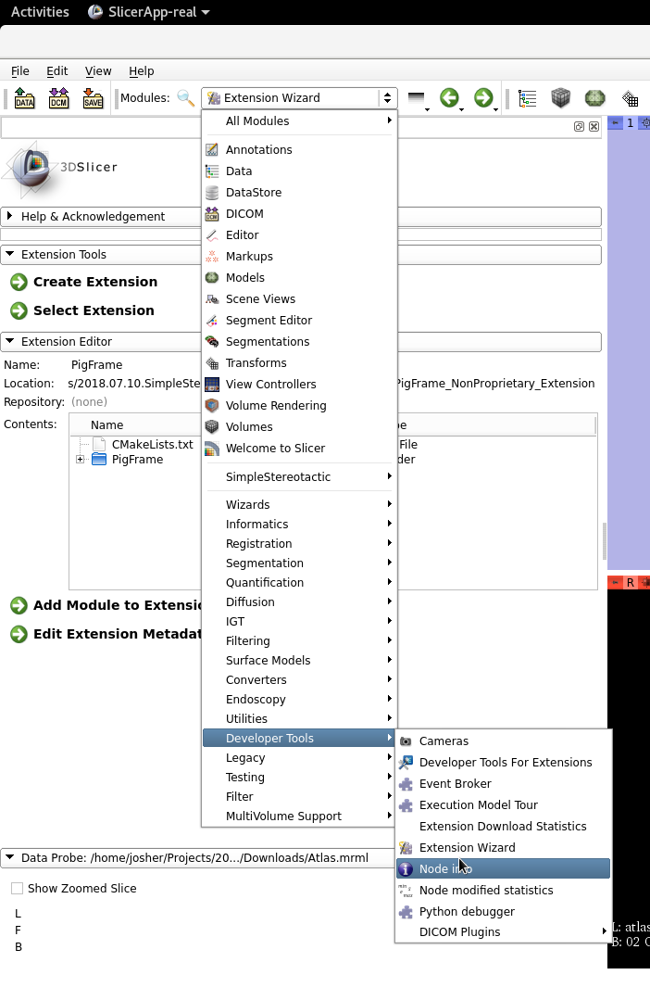
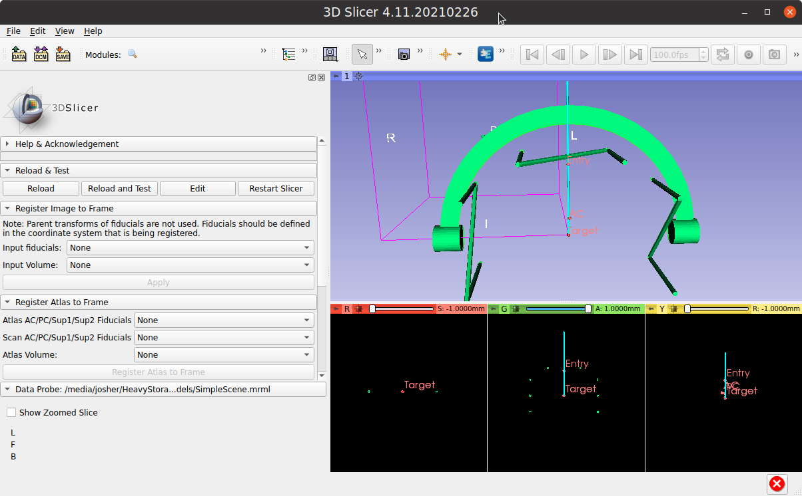

# SimpleStereotactic
This is an unregistered 3D Slicer Project to assist in stereotactic navigation with a compass frame.

The coordinates describe the compass parameters necessary to reproduce the targeting.

**Extension Requirements:** SlicerIGT from the Slicer Extension Manager (Install and Restart Slicer)

**Loading the Extension:** Navigate to the Extension Wizard Found under Modules->Developer Tools->Extension Wizard

Navigate to <gitroot>/SimpleStereotactic/PigFrame_NonProprietary_Extension/ to load extension:

**Select Extension:**

This loads the blank extension that is ready to load both images and atlas.

**The sequence of use is as follows:**

1. Acquire image: Drag and drop image representing an MRI or CT with a localizer (z-bar, n-bar) into 3D Slicer
2. Register Image to Frame: 
   - Create a Fiducial set that places fiducials in the middle of the cross section of the localizer at several depths
   - Select Fiducials and Image in the "Register Image to Frame" Section of the Extension
   - Press Apply
3. Register Atlas to Frame: After selecting the Anterior Commissure (AC) and Posterior Commissure(PC) on the Image
   - Select AC/PC for the Atlas 
   - Select AC/PC for the Image
   - Press "Register Atlas to Frame"
4. Target and Trajectory:  Plan as seen fit.

A pig atlas can be downloaded from https://www6.rennes.inra.fr/adnc_eng/Home/News-Focus/Pig-brain-atlas or more directly https://www6.rennes.inra.fr/adnc_eng/content/download/3394/36018/version/1/file/Atlas.mrb
